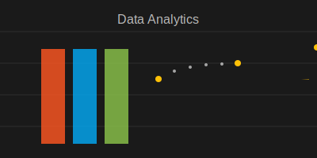

# Welcome to My GitHub

👋 Hello! I'm Hung Nguyen, a second-year student at LAB University of Applied Sciences, majoring in International Business with a focus on Data Analysis and Data Engineering. Thanks for visiting my GitHub!

## About Me
📊 Passionate about data, I specialize in Python and SQL programming. I am particularly interested in Data Engineering, Database Administration, and leveraging Power BI to transform data into actionable insights.

## Skills
💻 **Proficient in**:
- Python
- SQL
- Visualization tools: Power BI, Looker Studio. 

## On-going Learning: 
📖 Focusing on enhancing my skills in Data Engineering and improving analytical mindset, I do not forget to continually stay updated on emerging technologies and industry trends 🧐.

## Connect with me !!
📧 Feel free to reach out via email at [hunghnguyen.work@gmail.com](mailto:hunghnguyen.work@gmail.com).

🔗 Connect with me on [LinkedIn](https://www.linkedin.com/in/hung-nguyen) for professional networking.

Let’s collaborate and create something impactful together! 🚀

